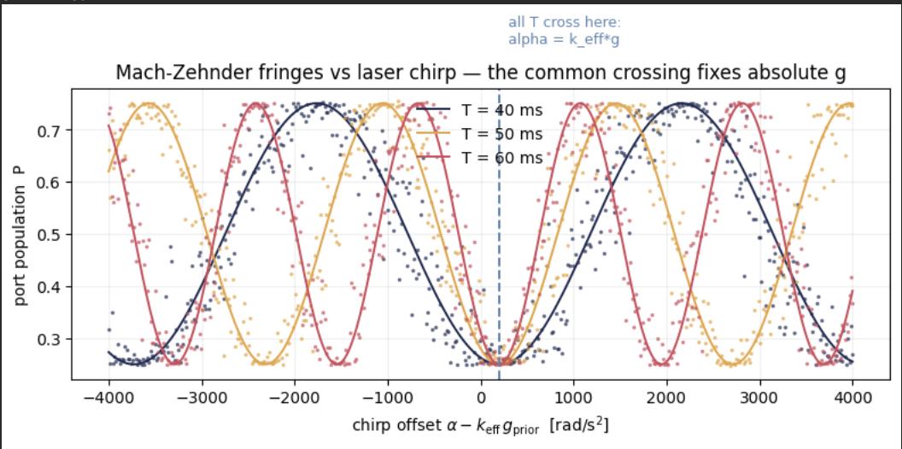
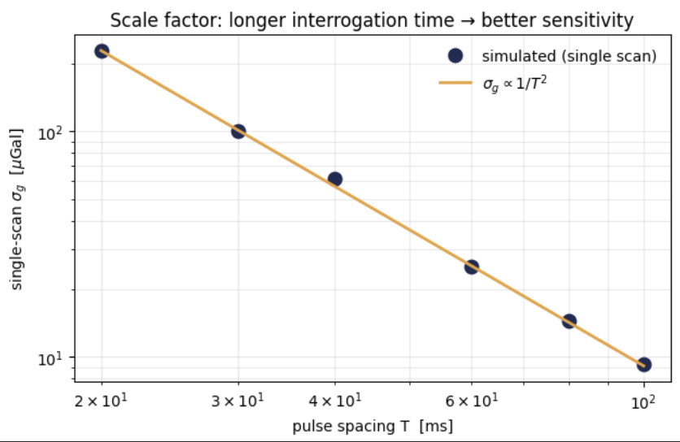
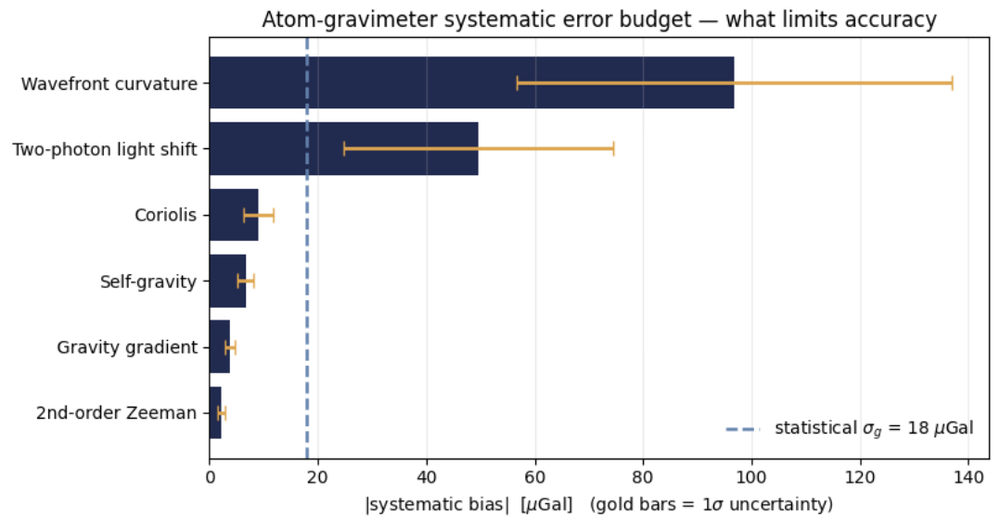
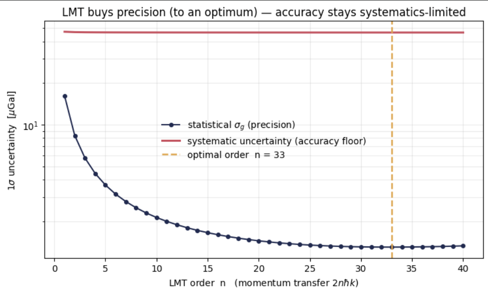
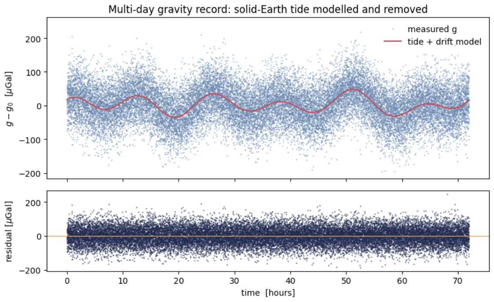
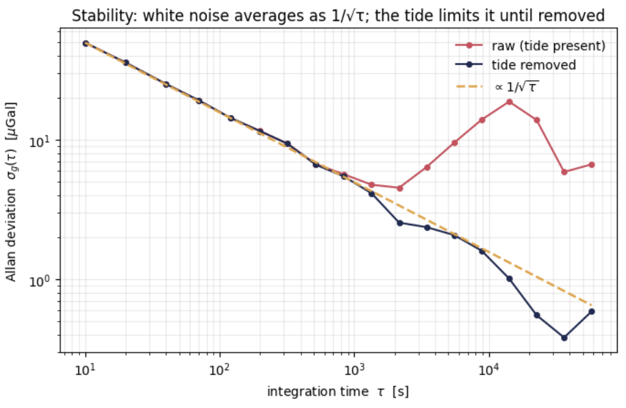

# End-to-End-Atom-Gravimeter_A-Digital-Twin


A from-first-principles numerical model of a light-pulse (Mach–Zehnder) atom
gravimeter, built in four self-contained steps: from the interferometer phase,
to absolute-$g$ recovery, to a full systematic error budget, to large-momentum-transfer
scaling, to multi-day stability analysis with the Allan deviation.

**Goal.** To model how a light-pulse atom gravimeter works — how it reads $g$, what limits its accuracy, what large momentum transfer buys, and how it behaves over time — with runnable code for every step.

> **Scope:** This is a simulation with synthetic data. The orders of
> magnitude match published rubidium-gravimeter error budgets, but absolute numbers
> depend on the chosen operating parameters (beam curvature, residual light shift,
> magnetic field, etc.); a real instrument fixes these by calibration. No
> experimental data are used.

---

## Physical system

A cloud of <sup>87</sup>Rb atoms in free fall is interrogated by a vertical,
retro-reflected laser beam driving two-photon transitions. Three pulses
($\frac{\pi}{2}-\pi-\frac{\pi}{2}$) separated by equal free-evolution times $T$ form
a Mach–Zehnder interferometer:

```
 π/2 ───── T ───── π ───── T ───── π/2
(split)         (redirect)        (recombine)
```

**Constants (<sup>87</sup>Rb, D2 line):**

$$
k = \frac{2\pi}{\lambda}, \qquad
k_{\text{eff}} = 2k, \qquad
v_{\text{rec}} = \frac{\hbar k}{m}
$$

with $\lambda = 780.241\ \text{nm}$, $m = 86.909\,u$, giving
$k_{\text{eff}} = 1.61\times10^{7}\ \text{rad/m}$ and $v_{\text{rec}} = 5.88\ \text{mm/s}$.
Gravity is reported in microGal: $1\ \mu\text{Gal} = 10^{-8}\ \text{m/s}^2$.

---

**Requirements:** `numpy`, `scipy`, `matplotlib` (all pre-installed in Google Colab).

```bash
pip install numpy scipy matplotlib
python gravimeter_step1.py
```

---

## Step 1 — The engine: phase, fringe, and absolute-$g$ recovery

**Interferometer phase.** The leading-order inertial phase for pulse spacing $T$
and laser chirp rate $\alpha$ (which compensates the falling-atom Doppler shift) is

$$
\Phi = \left(k_{\text{eff}}\,g - \alpha\right) T^{2}.
$$

**Readout.** The population in one output port is a fringe in $\Phi$:

$$
P = P_0 - \tfrac{1}{2}\,C\cos\Phi,
$$

with offset $P_0 \approx 0.5$ and contrast $C$.

**Realistic noise.** Vibration adds a per-shot random phase
$\varphi_{\text{vib}}\sim\mathcal{N}(0,\sigma_\varphi)$; atom shot noise comes from
detecting a finite number $N$ of atoms,

$$
n_{\text{port}} \sim \text{Binomial}(N, P), \qquad P_{\text{meas}} = n_{\text{port}}/N .
$$

**Why a single $T$ is not enough.** A single fringe determines $\Phi$ only modulo
$2\pi$, so the absolute $g$ is ambiguous. But the condition $\alpha = k_{\text{eff}}\,g$
gives $\Phi = 0$ for **every** $T$ — so fringes taken at several $T$ all cross at one
chirp value $\alpha_0$, which fixes

$$
\boxed{\,g = \alpha_0 / k_{\text{eff}}\,}.
$$

A joint multi-$T$ fit recovers $g$ unambiguously.

**Scale factor.** Sensitivity to gravity is

$$
\frac{\partial\Phi}{\partial g} = k_{\text{eff}}\,T^{2}
\quad\Longrightarrow\quad
\sigma_g = \frac{\sigma_\Phi}{k_{\text{eff}}\,T^{2}} \;\propto\; \frac{1}{T^{2}} .
$$





**Results.**

| Quantity | Value |
|---|---|
| Effective wavevector $k_{\text{eff}}$ | $1.61\times10^{7}$ rad/m |
| Recoil velocity $v_{\text{rec}}$ | $5.88$ mm/s |
| Resonant chirp $\alpha_0 = k_{\text{eff}}\,g$ | $2\pi\times 25.15$ MHz/s |
| Recovered $g$ | $9.81271228\ \text{m/s}^2$ |
| True $g$ | $9.81271234\ \text{m/s}^2$ |
| Recovery error | $-6\ \mu\text{Gal}$ |
| Statistical $1\sigma$ | $18\ \mu\text{Gal}$ |

The chirp rate reproduces the value used in real Rb gravimeters; sensitivity follows
the expected $1/T^{2}$ scale factor.

---

## Step 2 — What limits accuracy: the systematic error budget

Statistical noise (Step 1) sets **precision** and averages down with more shots.
**Systematics** are fixed biases that do *not* average down — they must be modelled
and corrected. Each effect is converted into a $g$-bias from its phase shift,

$$
\delta g = \frac{\delta\phi}{k_{\text{eff}}\,T^{2}},
$$

and each carries an uncertainty from imperfect knowledge of its parameters.

| Effect | Physical origin | Leading expression |
|---|---|---|
| Wavefront curvature | finite-radius beam over an expanding cloud | $\delta g = \langle r^2\rangle / (2 R T^2)$ |
| Two-photon light shift | residual differential AC-Stark phase | $\delta g = \delta\phi_{\text{LS}}/(k_{\text{eff}} T^2)$ |
| Coriolis | $2\,\boldsymbol{\Omega}\times\mathbf{v}$ from transverse velocity | $\delta g = 2\,\Omega\cos\!\varphi_{\text{lat}}\,v_x$ |
| Self-gravity | Newtonian pull of nearby apparatus mass | $\delta g = G M / d^2$ |
| Gravity gradient | $g$ referred to the wrong height | $\delta g = \gamma\, z_{\text{eff}}$ |
| 2nd-order Zeeman | quadratic magnetic shift, arm imbalance | $\delta g = 2\pi\,\delta\nu / (k_{\text{eff}} T)$ |

Total bias is summed linearly; the budget's bottom line is the quadrature sum of the
**uncertainties** of the corrections:

$$
\sigma_{\text{syst}} = \sqrt{\textstyle\sum_i \sigma_i^2}.
$$



**Results.**

| Effect | Bias [µGal] | Uncertainty [µGal] |
|---|---:|---:|
| Wavefront curvature | 96.80 | 40.17 |
| Two-photon light shift | 49.67 | 24.84 |
| Coriolis | 8.98 | 2.69 |
| Self-gravity | 6.67 | 1.49 |
| Gravity gradient | 3.70 | 0.96 |
| 2nd-order Zeeman | 2.24 | 0.67 |
| **Total bias** | **168.07** | — |
| **Total systematic uncertainty** | — | **47.34** |
| Statistical $\sigma$ (Step 1) | — | 18.00 |

After bias correction: $g = 9.81271060 \pm 51\ \mu\text{Gal}$ (statistical $18\oplus$
systematic $47$). **Accuracy is systematics-limited** ($47 > 18\ \mu\text{Gal}$), and
the budget ranks what to fix first — here, wavefront curvature and the light shift.

---

## Step 3 — What large momentum transfer (LMT) buys

LMT scales the beam-splitter momentum to $2n\hbar k$:

$$
k_{\text{eff}}(n) = 2nk .
$$

The scale factor grows with $n$, so statistical precision improves — but contrast
decays with each diffraction order, $C(n) = C_0\,\eta^{\,n}$, giving an **optimal**
order:

$$
\sigma_g(n) = \frac{1}{C(n)\,\sqrt{N}\;k_{\text{eff}}(n)\,T^{2}}
\;\propto\; \frac{1}{n\,\eta^{\,n}} .
$$

Systematics scale differently with $n$: kinematic and wavefront biases are
**independent of $n$** (their phase and the scale factor both scale as $k_{\text{eff}}$,
so the ratio cancels), while frequency/energy-type biases such as the 2nd-order Zeeman
scale as $1/n$.



**Results.**

| LMT order $n$ | Statistical $\sigma_g$ [µGal] |
|---:|---:|
| 1 | 16.19 |
| 5 | 3.66 |
| 10 | 2.13 |
| 20 | 1.44 |
| **33 (optimum)** | **1.30** |

Precision improves from $16$ to $\sim1.3\ \mu\text{Gal}$ at the optimum, but the
systematic accuracy floor ($\sim47\ \mu\text{Gal}$) does **not** move. More momentum
buys precision, not accuracy.

---

## Step 4 — The instrument as a geodetic sensor

A gravimeter is run as a continuous record, not a single shot. A multi-day time
series is simulated as

$$
g(t) = g_0 + \underbrace{\sum_i A_i \sin(2\pi f_i t + \phi_i)}_{\text{solid-Earth tide}}
       + \underbrace{d\,t}_{\text{drift}} + \text{white noise},
$$

with four real tidal constituents (M2, S2, O1, K1). Their known frequencies are fit
(amplitude + phase) together with a linear drift and removed.

**Stability** is quantified with the (non-overlapping) Allan deviation,

$$
\sigma_g(\tau) = \sqrt{\tfrac{1}{2}\big\langle (\bar y_{i+1}-\bar y_i)^2 \big\rangle_\tau},
$$

where $\bar y_i$ are averages over bins of length $\tau$. White noise averages down as
$\sigma_g(\tau)\propto 1/\sqrt{\tau}$; an unremoved tide breaks this at long $\tau$.





**Results** (3-day record, 10 s sampling, 50 µGal white noise):

| Quantity | Recovered | True |
|---|---:|---:|
| M2 amplitude | 38.6 µGal | 40 |
| S2 amplitude | 15.4 µGal | 18 |
| O1 amplitude | 30.0 µGal | 30 |
| K1 amplitude | 41.4 µGal | 42 |
| Instrumental drift | 1.65 µGal/day | 2.0 |
| Residual std | 49.9 µGal | (50 floor) |

The raw Allan deviation rises beyond $\tau\sim10^3$ s because the tide dominates
long-term averaging; after the tide is modelled and removed, the deviation follows
$1/\sqrt{\tau}$ down to sub-µGal stability.

---

## Key takeaways

- **Absolute $g$** comes from the common chirp crossing of several $T$ — a single
  fringe is ambiguous modulo $2\pi$.
- **Precision vs accuracy** are distinct: statistics average down ($1/\sqrt{N}$,
  $1/\sqrt{\tau}$); systematics are fixed biases that must be modelled.
- The **error budget** identifies the dominant systematics (wavefront, light shift)
  and sets the correction priority.
- **LMT** improves precision up to an optimal order; it does not lift the
  systematic accuracy floor.
- Run continuously, the instrument's largest real signal is the **solid-Earth tide**;
  modelling it recovers the full $1/\sqrt{\tau}$ integration benefit.

---

## References

- P. Storey & C. Cohen-Tannoudji, *The Feynman path integral approach to atomic
  interferometry*, J. Phys. II France **4**, 1999 (1994).
- A. Peters, K. Y. Chung & S. Chu, *High-precision gravity measurements using atom
  interferometry*, Metrologia **38**, 25 (2001).
- S. Abend et al., *Atom-chip fountain gravimeter*, Phys. Rev. Lett. **117**, 203003 (2016).
- M. Gebbe et al., *Twin-lattice atom interferometry*, Nat. Commun. **12**, 2544 (2021).

---

## License

Released for educational and research-reproduction purposes.
